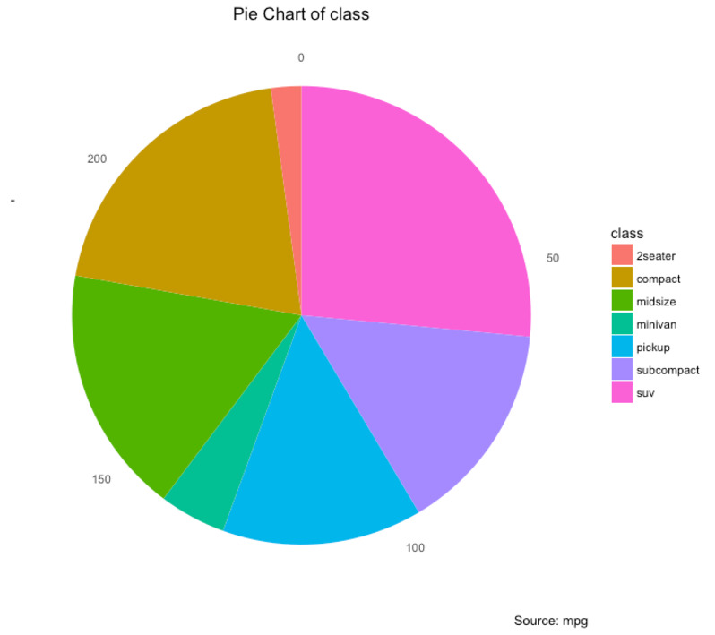
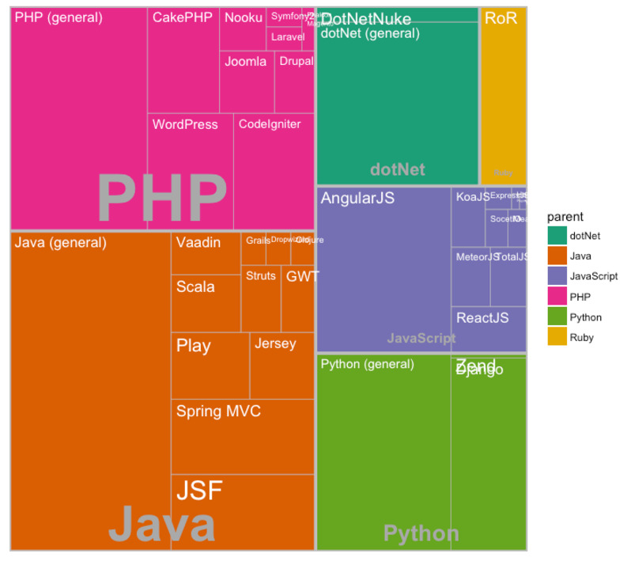
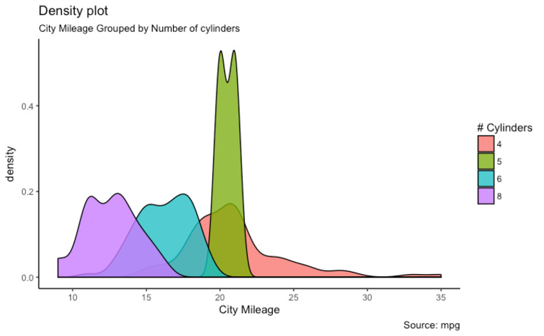
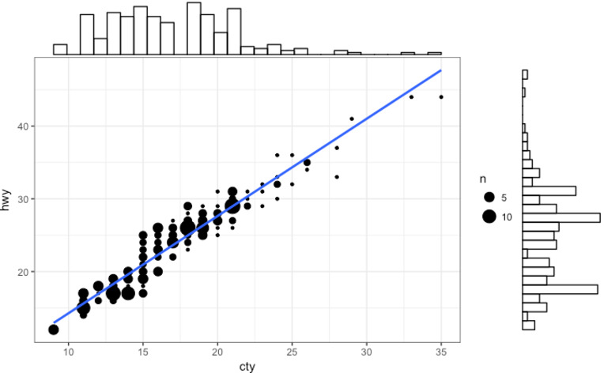
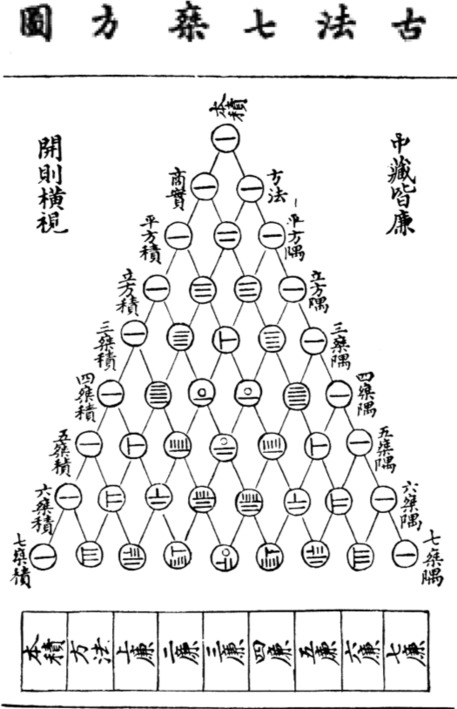
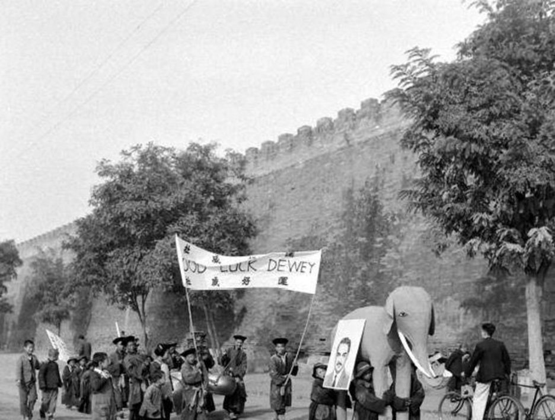
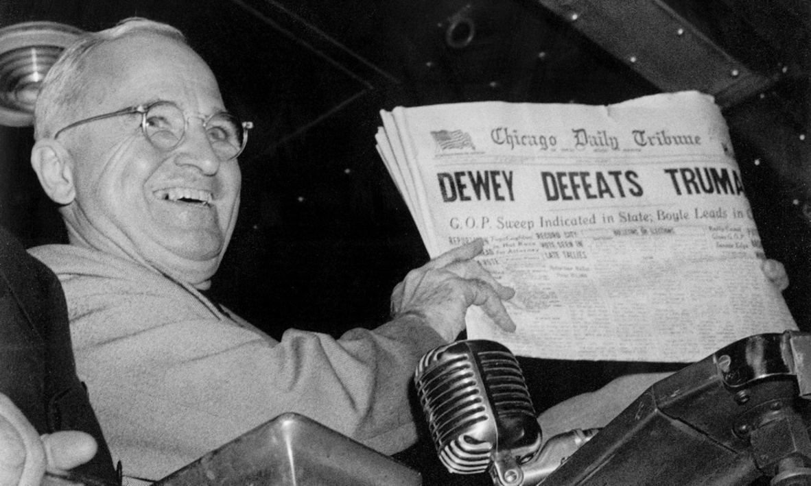

# 统计的科学基础

## 统计学是什么

\includegraphics{biostat.images/symbols.png}

---

* 数学家故弄玄虚的东西?
* 宣传者企图使我们信服, 有时就是欺骗我们的数值信息

---

\begin{exampleblock}{}
    {\large ``There are three kinds of lies: lies, damned lies, and statistics.''}
    \vskip5mm
    \hspace*\fill{\small--- Mark Twain}
\end{exampleblock}

\note{

谎言, 该死的谎言, 统计学.

}

## 逻辑思维的形式

* 科学方法
* 演绎
    * 提出一般的公理或假定
    * 推理, 得出命题
    * 确定的和绝对的 (?)
* 归纳
    * 从具体的经验和特殊的事实出发
    * 推理, 得出普遍结论的\alert{似真性}的评判
    * 不确定的

\note{

演绎, 古希腊人, 欧氏几何, 5个公理, 5个公设

牛顿力学, 三定律

哥德尔不完备定理

归纳, 18世纪末逐渐开始.1763年贝叶斯提出了第一个数学基础.

一个三段论就是一个包括有大前提、小前提和结论三个部分的论证.
凡人都有死（大前提）. 苏格拉底是人（小前提）. 所以：苏格拉底有死（结论）.

}

## 归纳推理的重要性

* 基本事实：自然界的事件和现象太多样, 太广泛或太不可及, 不能做出完全的观察.
    * "没有人能明白上帝从创世到末日的作为"
    * 不能在每一个人身上试验我们新的药物
* 在科学试验中得到的测量组构成一个样本
    * 无限重复试验, 得到测量的无限集合, 这个全集合被认作是总体
    * 样本的重要性在于它能透露有关它由之抽取的总体的某些事情

\note{

生物学, 医学, 药学都是归纳科学

}

## 统计学一词的意义

* 两层含义
    * 统计学意味着数值信息, 通常用表和图来表示.
    * 统计学是讨论\alert{不确切}推理的科学, 是\alert{归纳的科学方法}.

* 研究的对象是样本, 根据样本对母体的推断.

\note{

也是实验科学的基础

}

## 关于样本的主要问题

1. 如何有效地描述样本?
2. 由这个样本的证据如何推断有关总体的结论?
3. 这些结论有多可靠?
4. 如何取样本才能使它们尽可能说明问题并可信?

# 描述样本

---

* 初等统计学的主题
* 数据
    * 体重, 胆固醇水平, 微信里的朋友, 理发费用, 学生成绩
* 类别
    * 男/女, 可口可乐/百事, 遗传病, iPhone/Android
* 参数
    * 平均值 mean, $\mu$
    * 中位数 median
    * 方差 Var
    * 标准差 SD, $\sigma$

\note{

被平均了, 拖后腿了等

平均每个人有一个睾丸

}

---

## 描述组成

\note{

\url{http://r-statistics.co/Top50-Ggplot2-Visualizations-MasterList-R-Code.html}

}

---

---

## 描述分布

\note{

直方图 histogram

}

---

## 描述相关

---

## 时间序列

# 进入高级部分: 概率与分布

---

\begin{exampleblock}{}
    {\large ``If you can't explain something to a six-year-old, you really don't understand it yourself.''}
    \vskip5mm
    \hspace*\fill{\small--- Albert Einstein}
\end{exampleblock}

\note{

Frequently attributed to Richard Feynman

爱因斯坦没说过, 费曼说爱因斯坦说过这些.

白居易

老杨统计讲得不好, 叫初学者死记硬背更没有用

有时候讲得深一点对初学者反而是有好处的

}

## 帕斯卡三角

\begin{figure}
    \animategraphics[loop,controls]{1}{biostat.images/Pascal-}{0}{40}
    \caption{帕斯卡三角}
\end{figure}

\note{

每个数是它左上方和右上方的数的和

}

---

\note{

朱世杰《四元玉鉴》中的 "古法七乘方图"

}

## 抛硬币的概率

* 抛 4 次硬币, 两个正面的概率是多少?
* 包含 4 个对象的集合 $\{A, B, C, D\}$, 由两个对象组成的子集有多少?
* 一共 6 个 $\{AB, AC, AD, BC, BD, CD\}$
* 所有可能的序列总数也可以这样逐个数出来
    * 0 个对象: 1, 反反反反
    * 1 个对象: 4, 正反反反, 反正反反, 反反正反, 反反反正
    * 3 个对象: 4, 反正正正, 正反正正, 正正反正, 正正正反
    * 4 个对象: 1, 正正正正
    * $1+4+6+4+1=16$
* 概率是 $6 \div 16 = 0.375$

\note{

一个个数 AB, AC...

$1+4+6+4+1=16$ 是不是有似曾相识的感觉?

}

---

\center\includegraphics[width=0.5\columnwidth]{biostat.images/Pascal_C_4_2.jpg}

\begin{equation*}
    \begin{split}
    16 & \rightarrow 2^4 \\
    1, 4, 6, 4, 1 & \rightarrow \text{帕斯卡三角的第五行} \\
    6 & \rightarrow \text{第五行的第三列}
    \end{split}
\end{equation*}

\note{

因为是丛空集开始的, 所以序数也从 0 开始

第五行的序数是 4, 第三列的序数是 2

}

## 帕斯卡三角里的概率

创建一个空白 Excel 工作薄

1. 在 `A1:A20` 中填上 1
2. 在 `B2` 里填 1
3. 在 `B3` 里填公式 `=A2+B2`
4. 拷贝这个公式到 `B3:T20`
5. 对 `A1:T20` 设置条件格式, 所有等于 0 的单元格, 前景设为白色, 背景也设为白色
6. 在 `U1` 里填公式 `=SUM(A1:T1)`, 拷贝这个公式到 `U1:U20`
7. 设置所有单元格列宽为 6
8. 将当前工作表全名为 `Triangle`

\note{

注意第二列是从 0 开始的序数, 第三列是三角形数, 毕达哥拉斯

跳棋是 10, 台球是 15

}

---

创建新工作表

1. 在 `A1` 填入公式 `=Triangle!A1/Triangle!$U1`
2. 拷贝这个公式到 `A1:T20`
3. 选择 `A2:T20`, 插入一个折线图

\note{

Excel 公式里, `Sheetname!A1` 表示其它工作表的单元格

`$U1` 里的 `$` 表示绝对单元格, 不会随当前单元格而变化

7 个里面取 4 个的概率, 等等

}

---

\note{

可以观察到, 随着 N 增大, 密度分布有点像一个似曾相识的钟形曲线

}

## 二项式系数

\begin{equation*}
    \begin{split}
    (x+y)^0 & = 1  \\
    (x+y)^1 & = x+y \\
    (x+y)^2 & = x^2 + 2xy + y^2 \\
    (x+y)^3 & = x^3 + 3 x^2 y + 3 x y^2 + y^3 \\
    (x+y)^n & = \sum_{k=0}^n {n \choose k} x^{n - k} y^k
    \end{split}
\end{equation*}

\note{

杨辉三角又与乘方有什么关系?

}

## 组合数

从 $n$ 个元素的集合中选取 $k$ 个元素组成的子集的个数

$$\text{ from } n \text{ choose } k$$

$$\binom{n}{k}=\frac{n!}{k!(n-k)!}$$

\center{ $C^{n}_{k} \quad C^{k}_{n} \quad _nC_k \quad ^nC_k \quad C(n,k)$ }

\note{

我高中学数学时, 是先讲排列再讲组合的, 但其实组合更基础些

\url{https://en.wikipedia.org/wiki/Binomial_theorem}

}

## 一些专业术语

抛硬币实验是一种

伯努利实验
: 只有两种可能结果的单次随机试验, 成功或失败, 是或非, 1 或 0. \alert{是/非实验}.

\bigskip

硬币正面或反面的概率服从

大数定律
: 描述相当多次数重复实验的结果的定律. 样本数量越多, 则其平均就越趋近期望值.

\bigskip

多次重复抛硬币实验, 得到的概率分布称为

二项分布
: $n$ 个独立的是/非实验中成功的次数的离散概率分布.

\note{

雅各布·伯努利 Jakob I. Bernoulli

* 在重复试验中, 随着试验次数的增加, 事件发生的频率趋于一个稳定值

* 在对物理量的测量实践中, 测定值的算术平均也具有稳定性

二项分布的名字来源于二项式系数

}

## 高尔顿板

\href{https://www.mathsisfun.com/data/quincunx.html}{模拟}

\href{run:./biostat.images/Galton_box.webm}{视频}

\note{

但这些只是些数字游戏罢了, 给真实世界里会不会有什么变化也说不定

\url{https://en.wikipedia.org/wiki/Bean_machine}

}

## 二项分布的例子

* 选举
    * 民意测验表明, 1218 位选民中, 516 位赞成某候选人. 你认为他能赢吗?
* 医学
    * 一个指标病人, 1995 年被诊断有肺结核. 对该指标病人的 232 个同事进行了肺结核的筛选检验.
      在检验中读数为阳性记录的同事的人数, 是不是要高于随机人群中的记数.

\note{

1218 个独立是/非试验

232 个独立是/非试验

}

## 生物表型特征

* 由单基因决定的表型, 即孟德尔遗传的特征, 有显隐性的 3:1 的分离比
    * 单/双眼皮
    * 耳垂
    * 美人尖
    * 喝酒脸红
    * ...

---

* 决大多数生物学表型特征, 都由多基因及环境条件决定, 都服从正态分布或者可以转化为正态分布
    * 身高
    * 新生儿体重
    * 药物对疾病的效果
    * 种子的大小
    * 光合作用的速率
    * ...

# 样本偏差

## 瓦尔德与弹孔

场景:

* 二战中, 美军不希望飞机被德军的战斗机击落, 因此要为飞机披上装甲. 但是, 装甲会增加飞机的重量, 飞机的机动性就会减弱,
  还会消耗更多的燃油. 防御过度并不可取, 但是防御不足又会带来问题.
* 如果把装甲集中装在飞机最需要的部位, 那么即使减少装甲总量, 对飞机的防护作用也不会减弱.

\note{

瓦尔德是奥地利犹太裔数学家, 年轻时被纳粹迫害去了美国

Excerpt From: 美乔丹·艾伦伯格（Jordan Ellenberg）. “魔鬼数学：大数据时代, 数学思维的力量.”

}

---

| 飞机部位 | 每平方英尺平均弹孔数 |
|:------:|:----------------:|
|  引擎   |       1.11       |
|  机身   |       1.73       |
| 油料系统 |       1.55       |
| 其余部位 |       1.80       |

:   调查数据

\begin{itemize}
    \item \pause{军官们的观点: 受攻击概率最高的部位}
    \item \pause{亚伯拉罕·瓦尔德: 损坏的概率应该是均等的, 引擎被击中的飞机未能返航.}
\end{itemize}

\note{

1平方英尺 ≈ 0.093平方米

大量飞机在机身被打得千疮百孔的情况下仍能返回基地, 这个事实充分说明机身可以经受住打击, 因此无须加装装甲.

}

---

\begin{itemize}
    \item 军官们在不经意间做出了一个假设: 返航飞机是所有飞机的随机样本.
    \item \pause{这个假设成立有个前提: 无论飞机的哪个部位被击中, 幸存的可能性是一样的.}
    \item \pause{幸存者偏差 (Survivorship bias)}
\end{itemize}

\note{

在野战医院里, 腿部受创的病人比胸部中弹的病人多, 其原因不在于胸部中弹的人少, 而是胸部中弹后难以存活.

拿破仑时代, 骑兵如果装备盔甲, 除头部分外, 也只有胸甲.

现代军人是不穿盔甲的, 只带一顶头盔.

瓦尔德拥有的空战知识、对空战的理解都远不及美军军官, 但他却能看到军官们无法看到的问题, 这是为什么呢?

统计思维里, 第一个要问的问题就是: ``你的假设是什么? 这些假设合理吗?''

}

## 1948 年美国总统大选

\note{

罗斯福的副总统

}

---

* 密苏里农民, 没有大学学历
* 民主党分裂
    * 左翼民主党成立进步党
    * 南方民主党成立迪克西民主党
* 民主党大会, 出现不祥的兆头

\note{

\url{http://culture.dwnews.com/history/news/2016-11-10/59781201.html}

\url{http://www.thepaper.cn/baidu.jsp?contid=1401061}

最后一位没有大学学历的美国总统

左翼民主党因为冷战因素在费城成立进步党

南方民主党因为种族问题

当杜鲁门出现在民主党的会场时, 他的支持者们从一个用鲜花扎成的自由之钟里放出 50 只鸽子作为和平的象征,
但其中一只正撞到了阳台上, 坠地而死. "一只死鸽!" 一位代表抬头看着杜鲁门大声嚷道.

}

---

---

* 三大民意调查机构
    * 盖洛普
    * 罗珀
    * 克罗斯利
* 媒体
    * 新闻周刊
    * 读者文摘
    * 纽约时报

\note{

民意调查机构从 1936 年总统大选开始, 进行有统计意义上的民意调查

}

---

\note{

相信民调就应该认输了

典型的杜鲁门式小站演讲是, 先谈谈当地的地理人文, 然后猛烈抨击共和党控制的国会, 接着介绍妻子女儿出场, 接受民众欢呼,
最后与民众互动.

}

---

\begin{figure}
    \begin{minipage}[b]{.48\linewidth}
        \includegraphics{biostat.images/whistle_stop_map.jpg}
    \end{minipage}
    \hfill
    \begin{minipage}[b]{.48\linewidth}
        \includegraphics{biostat.images/ElectoralCollege1948.jpg}
    \end{minipage}
\end{figure}

\note{

三万多公里的火车旅行

川普每天都进行 rally, 有时一天数场

}

---

---

以偏概全

* 民调样本只限于大中城市
* 富裕或中等家庭成员, 特别是家庭主妇, 才会购买报纸杂志并邮寄调查问卷
* 羞于表达政治观点

改进

* 调查方法上, 从不太精确的配额抽样转向随机概率抽样
* 为了把选民偏好在最后一刻的变化考虑进去, 民意调查几乎会一直持续到选举之夜
* 实名的电话民调与匿名的网络民调同时进行

\note{

Ascertainment bias

川普

}

# 总结

---

1. 如何有效地描述样本?
    * 数据, 类别, 参数, 图表
2. 由这个样本的证据如何推断有关总体的结论?
3. 这些结论有多可靠?
    * 数学上的理论基础
4. 如何取样本才能使它们尽可能说明问题并可信?
    * 避免偏差

\tiny\url{https://github.com/wang-q/lecture-slides/blob/master/slides/biostat.slides.pdf}
