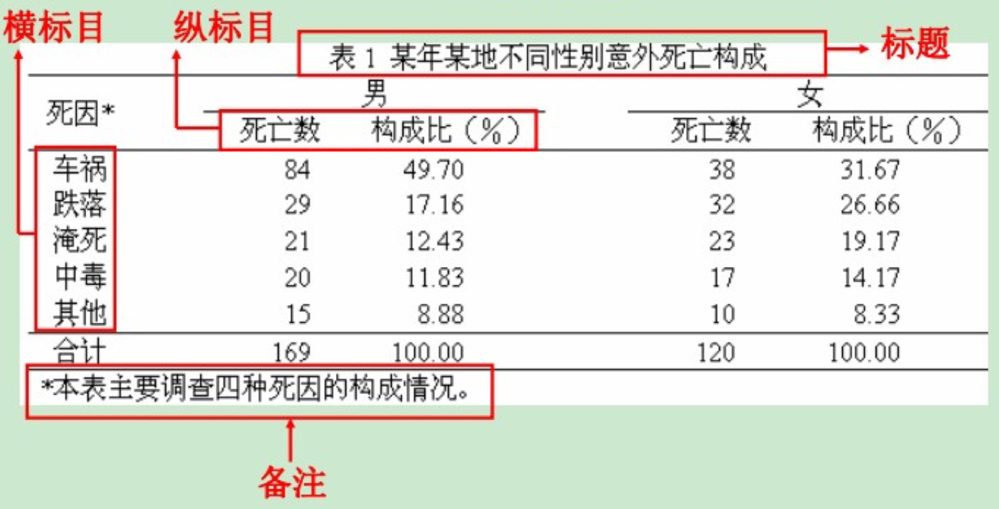
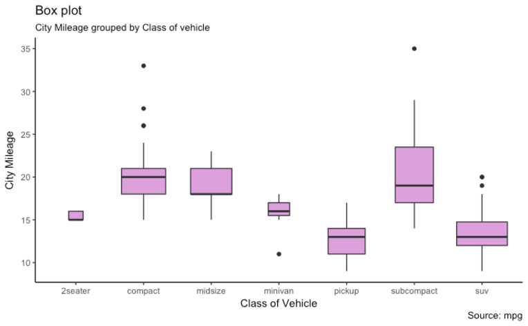
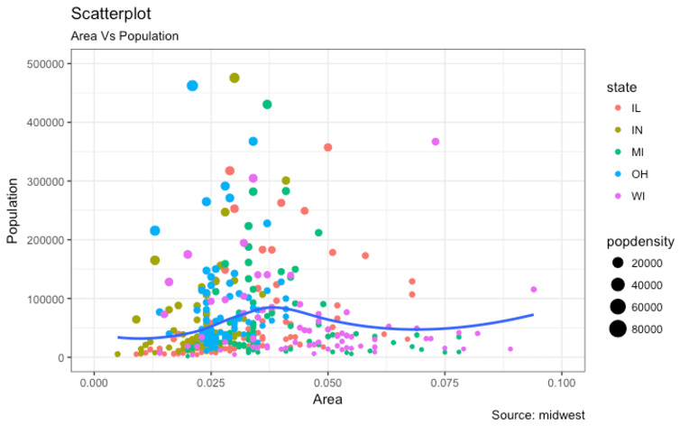
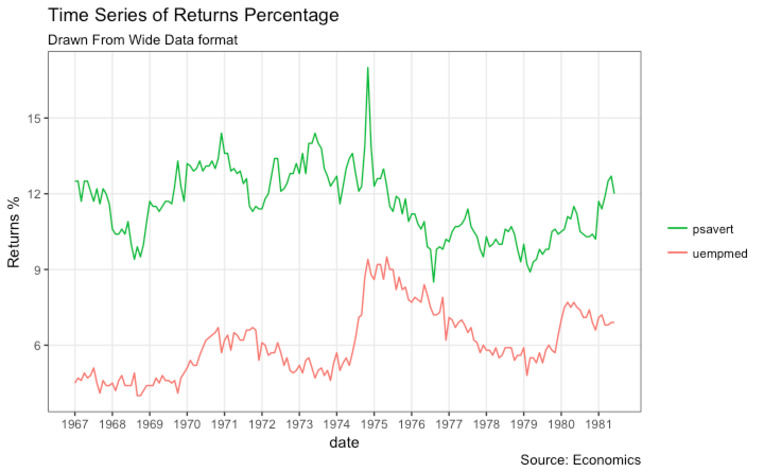

# 统计的科学基础

## 统计学是什么

\includegraphics{biostat.images/symbols.png}

---

* 数学家故弄玄虚的东西?
* 宣传者企图使我们信服, 有时就是欺骗我们的数值信息

---

\begin{exampleblock}{}
    {\large ``There are three kinds of lies: lies, damned lies, and statistics.''}
    \vskip5mm
    \hspace*\fill{\small--- Mark Twain}
\end{exampleblock}

\note{

谎言, 该死的谎言, 统计学.

}

## 逻辑思维的形式

* 科学方法
* 演绎
    * 提出一般的公理或假定
    * 推理, 得出命题
    * 确定的和绝对的 (?)
* 归纳
    * 从具体的经验和特殊的事实出发
    * 推理, 得出普遍结论的\alert{似真性}的评判
    * 不确定的

\note{

演绎, 古希腊人, 欧氏几何, 5个公理, 5个公设

牛顿力学, 三定律

哥德尔不完备定理

归纳, 18世纪末逐渐开始.1763年贝叶斯提出了第一个数学基础.

一个三段论就是一个包括有大前提、小前提和结论三个部分的论证.
凡人都有死（大前提）. 苏格拉底是人（小前提）. 所以：苏格拉底有死（结论）.

}

## 归纳推理的重要性

* 基本事实：自然界的事件和现象太多样, 太广泛或太不可及, 不能做出完全的观察.
    * "没有人能明白上帝从创世到末日的作为"
    * 不能在每一个人身上试验我们新的药物
* 在科学试验中得到的测量组构成一个样本
    * 无限重复试验, 得到测量的无限集合, 这个全集合被认作是总体
    * 样本的重要性在于它能透露有关它由之抽取的总体的某些事情

\note{

生物学, 医学, 药学都是归纳科学

}

## 统计学一词的意义

* 两层含义
    * 统计学意味着数值信息, 通常用表和图来表示.
    * 统计学是讨论\alert{不确切}推理的科学, 是\alert{归纳的科学方法}.

* 研究的对象是样本, 根据样本对母体的推断.

\note{

也是实验科学的基础

}

## 关于样本的主要问题

1. 如何有效地描述样本?
2. 由这个样本的证据如何推断有关总体的结论?
3. 这些结论有多可靠?
4. 如何取样本才能使它们尽可能说明问题并可信?

# 描述样本

---

* 初等统计学的主题
* 数据
    * 体重, 胆固醇水平, 微信里的朋友, 花在上班路上的时间, 理发费用, 学生成绩
* 类别
    * 男/女, 可口可乐/百事, 家族性遗传病, iPhone/Android
* 参数
    * 平均值 $\mu$, 众数, 中位数, 方差, 标准差 $\sigma$

\note{

被平均了, 拖后腿了等

平均每个人有一个睾丸

}

---

## 描述组成

\note{

\url{http://r-statistics.co/Top50-Ggplot2-Visualizations-MasterList-R-Code.html}

}

---

---

## 描述分布

\note{

直方图 histogram

}

---

## 描述相关

---

## 时间序列

# 进入高级部分: 概率与分布

---

\begin{exampleblock}{}
    {\large ``If you can't explain something to a six-year-old, you really don't understand it yourself.''}
    \vskip5mm
    \hspace*\fill{\small--- Albert Einstein}
\end{exampleblock}

\note{

Frequently attributed to Richard Feynman

爱因斯坦没说过, 费曼说爱因斯坦说过这些.

白居易

有时候讲得深一点对初学者反而是有好处的

老杨统计讲得不好, 叫初学者死记硬背更没有用

}

---

---

\begin{figure}
    \animategraphics[loop,controls]{1}{biostat.images/Pascal-}{0}{40}
    \caption{帕斯卡三角}
\end{figure}

## 抛硬币的概率

* 抛 4 次硬币, 两个正面的概率是多少?
* 包含 4 个对象的集合 $\{A, B, C, D\}$, 由两个对象组成的子集有多少?
* 一共 6 个 $\{AB, AC, AD, BC, BD, CD\}$
* 所有可能的序列总数也可以这样逐个数出来
    * 0 个对象: 1
    * 1 个对象: 4
    * 3 个对象: 4
    * 4 个对象: 1
    * $1+4+6+4+1=16$
* 概率是 $6 \div 16 = 0.375$

\note{

一个个数 AB, AC...

$1+4+6+4+1=16$ 是不是有似曾相识的感觉?

}

---

\center\includegraphics[width=0.5\columnwidth]{biostat.images/Pascal_C_4_2.jpg}

\begin{equation*}
    \begin{split}
    16 & \rightarrow 2^4 \\
    1, 4, 6, 4, 1 & \rightarrow \text{帕斯卡三角的第五行} \\
    6 & \rightarrow \text{第五行的第三列}
    \end{split}
\end{equation*}

\note{

因为是丛空集开始的, 所以序数也从 0 开始

第五行的序数是 4, 第三列的序数是 2

\url{https://www.mathsisfun.com/data/quincunx.html}

}
# 样本偏差

---

场景:

* 二战中, 美军不希望飞机被德军的战斗机击落, 因此要为飞机披上装甲. 但是, 装甲会增加飞机的重量, 飞机的机动性就会减弱,
  还会消耗更多的燃油. 防御过度并不可取, 但是防御不足又会带来问题.
* 如果把装甲集中装在飞机最需要的部位, 那么即使减少装甲总量, 对飞机的防护作用也不会减弱.

\note{

Excerpt From: 美乔丹·艾伦伯格（Jordan Ellenberg）. “魔鬼数学：大数据时代, 数学思维的力量.”

}

---

| 飞机部位 | 每平方英尺平均弹孔数 |
|:------:|:----------------:|
|  引擎   |       1.11       |
|  机身   |       1.73       |
| 油料系统 |       1.55       |
| 其余部位 |       1.80       |

:   调查数据

\begin{itemize}
    \item \pause{军官们的观点: 受攻击概率最高的部位}
    \item \pause{亚伯拉罕·瓦尔德: 损坏的概率应该是均等的, 引擎被击中的飞机未能返航.}
\end{itemize}

\note{

1平方英尺 ≈ 0.093平方米

大量飞机在机身被打得千疮百孔的情况下仍能返回基地, 这个事实充分说明机身可以经受住打击, 因此无须加装装甲.

}

---

\begin{itemize}
    \item 军官们在不经意间做出了一个假设: 返航飞机是所有飞机的随机样本.
    \item \pause{这个假设成立有个前提: 无论飞机的哪个部位被击中, 幸存的可能性是一样的.}
    \item \pause{幸存者偏差 (Survivorship bias)}
\end{itemize}

\note{

在野战医院里, 腿部受创的病人比胸部中弹的病人多, 其原因不在于胸部中弹的人少, 而是胸部中弹后难以存活.

拿破仑时代, 骑兵如果装备盔甲, 除头部分外, 也只有胸甲.

现代军人是不穿盔甲的, 只带一顶头盔.

瓦尔德拥有的空战知识、对空战的理解都远不及美军军官, 但他却能看到军官们无法看到的问题, 这是为什么呢?

统计思维里, 第一个要问的问题就是: ``你的假设是什么? 这些假设合理吗?''

}

---

Ascertainment bias

---

杜鲁门与杜威

川普

