\note{

弗雷德里克·桑格

}

---

* 1955 年, 第一个蛋白质测序, 胰岛素
* 1958 年, 诺贝尔化学奖
* 1975 年, 双脱氧法, ddNTP
* 1977 年, 第一个基因组, $\phi$--X174 噬菌体
* 1980 年, 再度获得诺贝尔化学奖

\note{

我国人工合成牛胰岛素

70 年代早期, 基于双向层析的 DNA 测序

}

---

人类基因组计划

* 1985 年, 美国能源部正式提出人类基因组测序.
* 1990 年, 正式启动人类基因组测序.

---

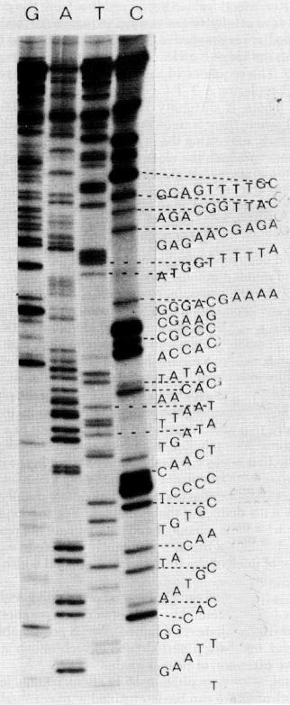

---

---

---

---

---

---

\begin{figure}
    \begin{minipage}[b]{.48\linewidth}
        \includegraphics{ch-24.images/image15.jpg}
    \end{minipage}
    \hfill
    \begin{minipage}[b]{.48\linewidth}
        \includegraphics{ch-24.images/image16.jpg}
    \end{minipage}
    \caption{J. Craig Venter (文特尔)}
\end{figure}

---

\note{

Then order scaffolds on the chromosomes using the HGP clone map and
other publicly available maps.

}

---

\note{

克林顿宣布只测序不能申请专利

}

---

\begin{figure}
    \begin{minipage}[b]{.48\linewidth}
        \includegraphics{ch-24.images/image18.jpg}
        \subcaption{Nature}
    \end{minipage}
    \hfill
    \begin{minipage}[b]{.48\linewidth}
        \includegraphics{ch-24.images/image19.jpg}
        \subcaption{Science}
    \end{minipage}
    \caption{基因组草图, 2001}
\end{figure}

# 二代: (短读长的) 高通量测序

## Personal Genomes

\begin{columns}[onlytextwidth]
    \column{0.5\textwidth}
        \begin{itemize}
            \item Craig Venter
            \item James Watson
            \item Stephen Quake
            \item George Church
            \item Marjolein Kriek
            \item Hermann Hauser
            \item Han Chinese
            \item Seong-Jin Kim
            \item Korean AK1
            \item Yoruban African NA18507
        \end{itemize}
    \column{0.5\textwidth}
        \begin{itemize}
            \item 14 others sequenced by Complete Genomics
            \item Unknown number sequenced by Knome
            \item 6 genomes sequenced at high depth by the 1000 Genomes Project
            \item 180 genomes sequenced at low coverage by the 1000 Genomes Project
            \item Two acute myeloid leukemia patients
        \end{itemize}
\end{columns}

\note{

三十亿美元

三千万美元

People Who’ve Had Their Genomes Sequenced

Stephen Quake, A Stanford engineer

Marjolein Kriek, a clinical geneticist at LUMC

Dr. Hauser, Partner, Amadeus Capital Partners Ltd, is the first consumer
to purchase Illumina's individual genome sequencing service.

}

---

---

---

\note{

http://www.ebiotrade.com/newsf/2010-3/2010315172205631.htm

}

---

\note{

Remember when you used to think that GenBank was ‘big’? The NCBI
Sequence Read Archive (SRA) now dominates the NCBI FTP site and accounts
for 1.14 Petabytes of storage (perhaps explaining why it is to be phased
out). In comparison, the Genome and GenBank directories on the FTP site
account for less than a tenth of one percent of all sequences. Sequences
from ‘traditional’ sequencing methods now contribute less and less to
genome projects. The so called ‘short’ reads – which are getting longer
all the time –  dominate the scene.

}

---

\note{

Intel Core i7-2700K. 	October 23, 2011

}

---

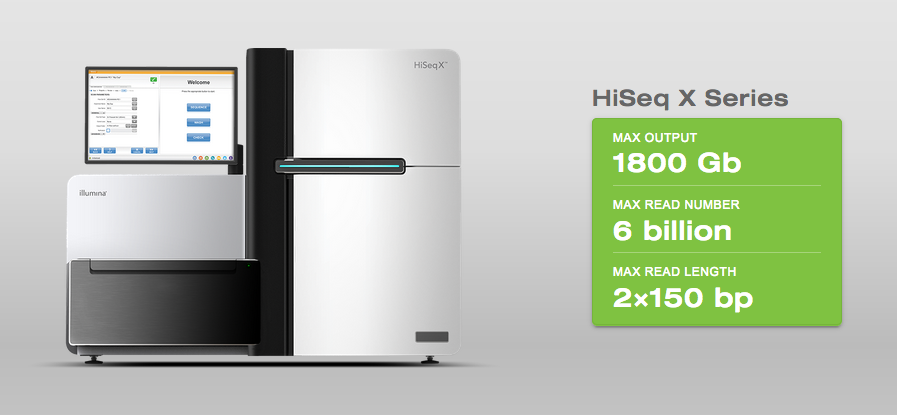

\center\large\alert{100 GB $\approx$ 33X Human genome $\approx$ 10,000 CNY}

\note{

足够在有几乎完美的参考基因组下, 拼装出人类个体基因组了.

刚推出时有限制, 只能用于人类基因组测序. 现在已经取消.

}

---

> 别再升级通量了, 测序仪卖不出去了.

> CEO, 侬脑子哇特了?

\note{

也有不高兴的, 但这是幸福地不高兴

}

## 其它二代方法

* Ion Torrent
* 454
* SOLiD
* Complete genomics

\note{

边合成边测序, Illumina

机器便宜, 临床上可能有点前途

焦磷酸测序, 读长长些, 罗氏, 已经放弃

边连接边测序, SOLiD, ABI

已被华大收购, 最有名的是 69 个人的基因组数据, ligation

}

---

在最近与彭博社的一次采访中, 奥巴马透露了自己想要进入科技风投界的想法.

> 我与硅谷以及风投的交流, 极大地满足了我对科学和组织的兴趣...
> 你可以只花几千美元, 而不是十万美元, 就可以把个人的基因绘制出来.
> 你可以有能力辨识自己的 (基因) 倾向, 去生产对你这个个体而言最有效的药物.
> 这只是可以让我坐下来, 与别人谈几个小时的科技创业的例子之一.

\note{

乐观派

感觉要进入共产主义社会了

}

# 三代: (长读长的) 单分子测序

## 二代的缺点

* 建库过程中扩增带来的偏性
* 高 GC 区域的覆盖度与准确性
* \alert{读长短}
    * 转座子 (transposons and retrotransposons)
    * 片段重复 (tandom or segment duplications)
    * 一般不超过 5 kbp, 但就是二代跨越不了的障碍

---

我们在甘蓝 (*Brassica oleracea*)\footnote{\fullcite{liu2014}} 基因组草图中发现了一个约 2 kbp 的片段,
重复数超过了 1000 次.

在其它完全基于二代测序的基因组里, 重复片段的数量都远大于用基于 BAC 的方法测序的物种.

基本都是测序与拼装中的错误.

\note{

华大做的. 只要是华大的, 都得打个问号.

本来有计划写篇文章的, 但很多物种错误实在太多, 程序跑不完了. 浪费我们服务器和超算的时间. 也就算了.

}

## 二代的对策

* Pair end (short jump)
* Mate pair (long jump)
* 10X Genomics

\note{

10 kbp, 复杂基因组拼接, 跨越重复区, 检出结构变异.

并没有什么用处.

\url{https://zhuanlan.zhihu.com/p/20723934}

}

## 三代的优势

\center\Huge{读长 \alert{长!}}

## 三代的原理

几个名词

* \Large\alert{PacBio}: \normalsize\underline{Pac}ific \underline{Bio}sciences
* SMRT: \underline{S}ingle \underline{M}olecule \underline{R}eal \underline{T}ime Sequencing
* ZMW: \underline{Z}ero-\underline{m}ode \underline{w}aveguide, 20 zl (zeptoliters, $10^{-21}$)

\note{

只介绍最有希望的方法, PacBio

单分子实时测序

20 普托升, 反应体系

waveguide, 光 波导管

}

---

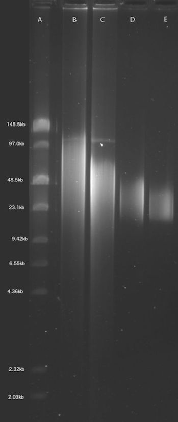

---

\note{

SMRTbell template

Hairpin adaptors (green) are ligated to the end of a double-stranded DNA molecule (yellow and
purple), forming a closed circle. The polymerase (gray) is anchored to the bottom of a ZMW and
incorporates bases into the read strand (orange).

}

---

\note{

Sequencing via light pulses

\scriptsize
A. A SMRTbell (gray) diffuses into a ZMW, and the adaptor binds to a polymerase immobilized at the
bottom.

B. Each of the four nucleotides is labeled with a different fluorescent dye (indicated in red,
yellow, green, and blue, respectively for G, C, T, and A) so that they have distinct emission
spectrums. As a nucleotide is held in the detection volume by the polymerase, a light pulse is
produced that identifies the base.

(1) A fluorescently-labeled nucleotide associates with the template in the active site of the
polymerase.

(2) The fluorescence output of the color corresponding to the incorporated base (yellow for base C
as an example here) is elevated.

(3) The dye-linker-pyrophosphate product is cleaved from the nucleotide and diffuses out of the ZMW,
ending the fluorescence pulse.

(4) The polymerase translocates to the next position.

(5) The next nucleotide associates with the template in the active site of the polymerase,
initiating the next fluorescence pulse, which corresponds to base A here.

}

---

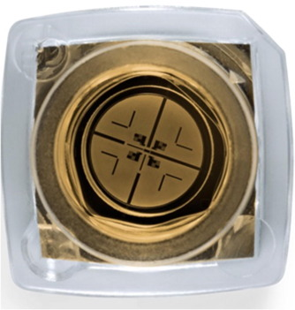

\note{

Each SMRT cell contains 150,000 ZMWs. Approximately 35,000–75,000 of these wells produce a read in a
run lasting 0.5–4 h, resulting in 0.5–1 Gb of sequence. The image is adapted with permission from
Pacific Biosciences . ZMW, zero-mode waveguide.

}

---

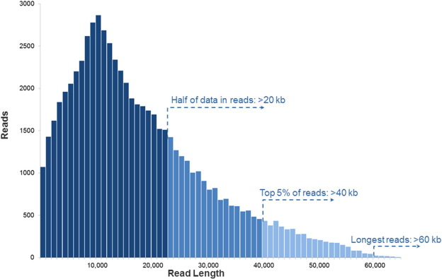

\note{

PacBio RS II read length distribution using P6-C4 chemistry

Data are based on a 20 kb size-selected E. coli library using a 4-h movie. Each SMRT cell produces
0.5–1 billion bases. The P6-C4 chemistry is currently the most advanced sequencing chemistry offered
by PacBio.

}

##  RS II 与 Sequel 对比

|           | RS II (P6-C4) |  Sequel  |
|:----------|:-------------:|:--------:|
| 运行时间   |    240 min    | 240 min  |
| 输出量     |   0.5-1 Gb    | 5-10 Gb  |
| 每日输出量  |     2 Gb      |  20 Gb   |
| 平均读长   |   10-15 kb    | 10-15 kb |
| 单程准确率  |   **~86%**    | **~86%** |
| 30X 准确率 |   >99.999%    | >99.999% |
| Reads 数  |      50k      |   500k   |
| 平台价格   |     $700k     |  $350k   |
| 运行成本   |     $400      |   $850   |

\note{

现在主流的两种 PacBio 平台. Sequel 是今年刚出来的.

P 指得是聚合酶, C 是化学试剂.

\url{http://allseq.com/knowledge-bank/sequencing-platforms/pacific-biosciences/}

错误是随机分布的, 目前还没有发现特别有规律的地方.

}

## 三代应用: 哺乳动物基因组

大猩猩基因组\footnote{\fullcite{gordon2016}}

|                |    Susie3     |     gorGor4     |    panTro4    |
|:---------------|:-------------:|:---------------:|:-------------:|
| Assembly size  | 3,080,414,926 |  3,063,362,754  | 3,323,267,922 |
| Total coverage |     74.8X     |     101.1X      |      6X       |
| Technology     |    PacBio     | Sanger/Illumina |    Sanger     |
| Contig N50     |   9,558,608   |     52,934      |    50,656     |
| #contigs       |    16,073     |     170,105     |    183,860    |

\note{

发在 Science 上, 要知道大猩猩基因组出来好多年了.

}

---

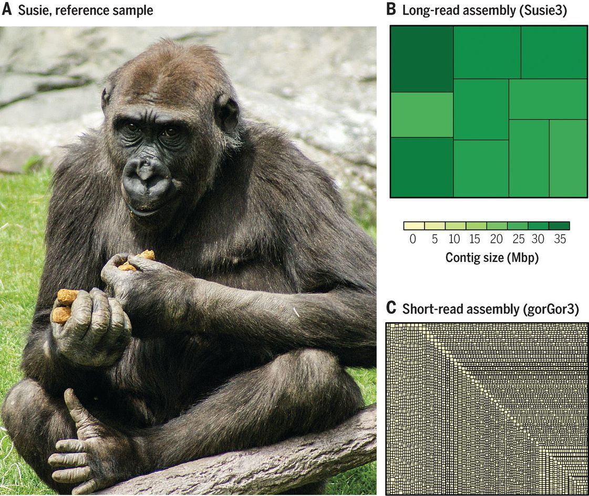

\note{

Long-read sequence assembly of the gorilla genome.

(A) Susie, a female Western lowland gorilla, was used as the reference sample for full-genome
sequencing and assembly.

(B and C) A treemaps representing the differences in fragmentation of the long-read and short-read
gorilla genome assemblies. The rectangles are the largest contigs that cumulatively make up 300 Mbp
(~10%) of the assembly.

}

## 三代应用: 全长转录组

玉米转录组\footnote{\fullcite{wang2016}}, 6 个组织.

二代测序只能准确地确定剪接点 (splice junctions), 对完整的转录本, 只能靠算法 (猜).

对于三代, 一个转录本就是一个单分子.

---

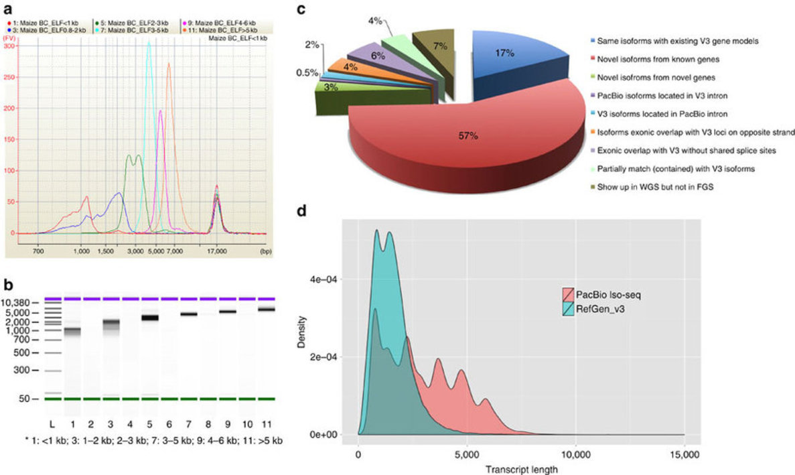

\note{

大量的新的可变剪接, 还发现未被注释的基因.

还有很多新的 lncRNA.

}

## 适用范围

|            |      Sequel       |          原因          |
|:-----------|:-----------------:|:---------------------:|
| 人类全基因组 |  Ok/\alert{Good}  | 贵; 利于鉴定结构变异及组装 |
| 小基因组    |   \alert{Good}    |  长读长, 只需要较低的通量  |
| 靶向测序    |   \alert{Good}    |  长读长, 只需要较低的通量  |
| 转录组      | Poor/\alert{Good} |  贵; 可得到全长的转录本   |
| 宏基因组    |      Poor/Ok      |  贵; 利于 de novo 组装  |
| 外显子组    |       Poor        | 贵; 长读长对外显子没有用处 |
| 表达谱      |       Poor        |           贵           |
| ChIP-Seq   |       Poor        |           贵           |

\note{

人类全基因组: 低偏向, 长读长,

Targeted 靶向, 如 HLA 分型 (人类白细胞抗原, Human Leukocyte Antigen)

RNA Profiling 表达谱

ChIP-Seq 染色质免疫沉淀接高通量测序

}

## 信息学的问题  {.shrink}

二代所用的算法和策略很多没法在三代上使用, 只能重新开发.

SMRT Analysis Software 包括了大量自有和第三方程序:

* 编程语言
    * C/C++
    * Bash
    * Java, Scala
    * Mono 3 (C#, VB.net)
    * Perl, Python
* 平台: Tomcat, MySQL
* 文件格式 HDF5 $\rightarrow$ BAM
* Celera Assembler, GMAP, HMMER, SAMtools 等

\note{

快速迭代

在版本更替过程中, 出现过多个程序, 有些已经死了, 有的正在死.

安装也比较麻烦.

}

## 商业化服务

* \small\url{http://www.pacb.com/products-and-services/service-providers/}
* \small\url{http://allseq.com/providers/}

---

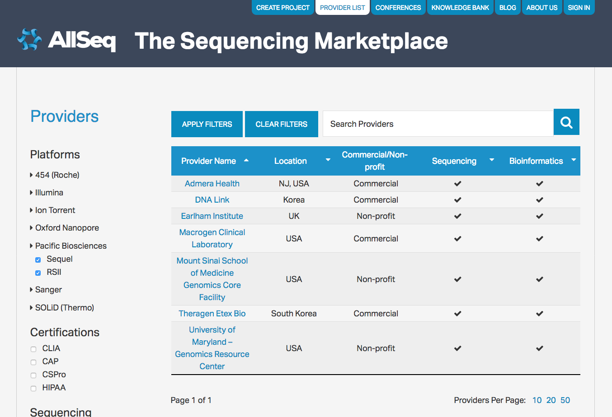

---

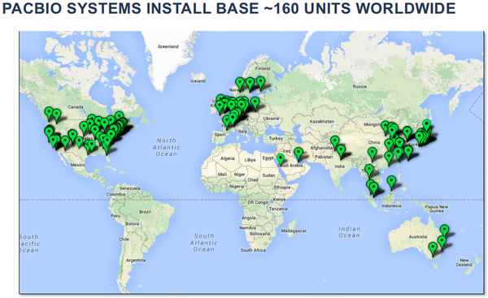

\note{

Sequel 的全球预购已达 50 余台, 很多客户都在等

}

---

\begin{figure}
    \includegraphics{pacbio.images/frasergen.png}
\end{figure}

武汉菲沙基因信息有限公司联合美国 Pacific Biosciences 公司在武汉东湖综合保税区共建高通量测序中心, 引进了不少于 6 台
Sequel 三代测序系统, 将建成大规模的三代测序中心.

\center\large\alert{1 GB $\approx$ 5,000 CNY}

\note{

诺和致源好像也在买

}

##  其它三代方法

* Helicos, 读长过短, 已经破产
* \alert{Oxford Nanopore}

\note{

Helicos, 也是基于单分子荧光技术

}

---

\note{

nanopore sequencing

宽度为 4 nm, 比双链 DNA 分子略宽, DNA 分子像一条线一样穿过纳米孔.

每种碱基的化学性质差异会导致流经该纳米孔的电流值发生变化, 因为每种碱基的电势不一样, 这样就可以分辨出各种碱基.

}

---

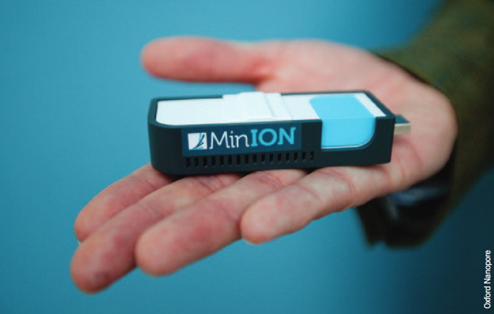

\note{

2012 年就公布了, 等到去年才上市. MinION, 优盘大小.

等到 2016 年才陆续上市.

}

---

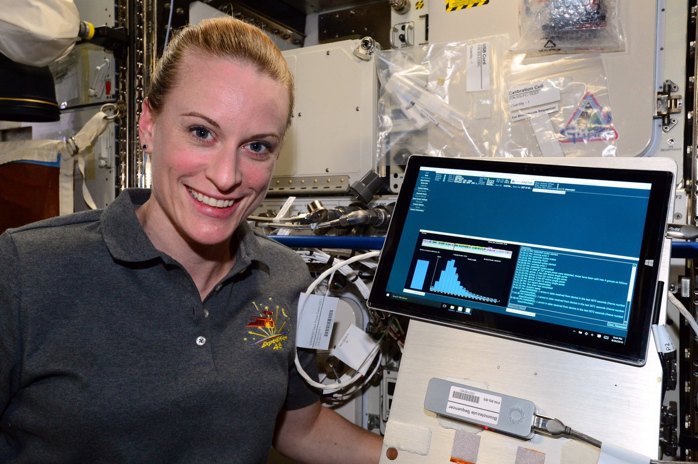

\note{

2016 年, NASA 带上了太空.

}

# 总结

---

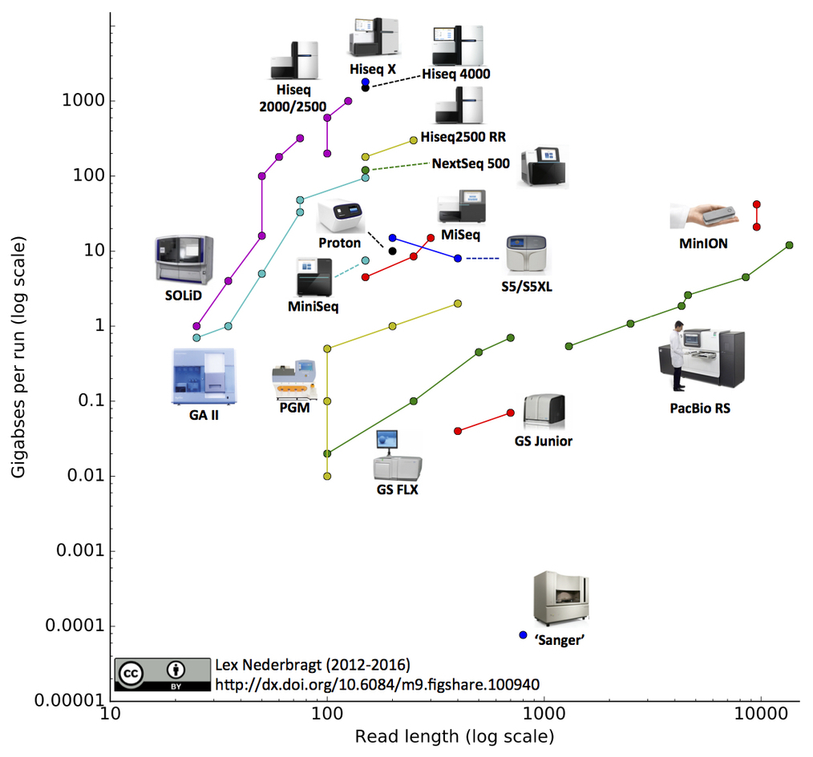

\note{

一代, 终归是一代, 始终有它存在的位置;

二代, 高通量;

三代, 长读长, 通量和准确度都还在提高.

}

---

\begin{figure}
    \includegraphics{pacbio.images/github-wang-q.png}
\end{figure}

\tiny\url{https://github.com/wang-q/lecture-slides/blob/master/slides/pacbio.slides.pdf}

\note{

没有 .ppt. 从源码编译出来的 .pdf.

}
